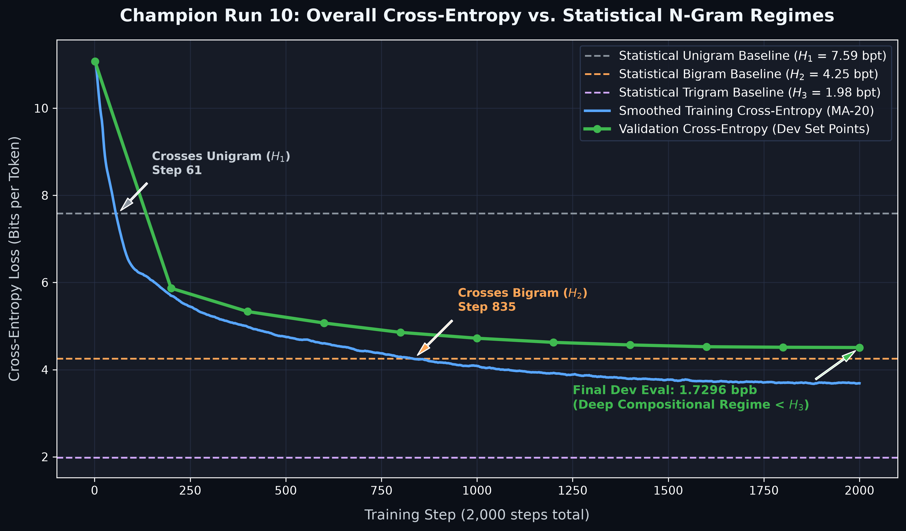

# Champion Model & Optimization Approach

### Best Model Metrics (`Run 10 Champion`)
- **Validation Bits Per Byte (`bpb`)**: **`1.7296`** (vs. `2.0320` Baseline & `2.0934` Tied)
- **Validation Bits Per Token (`bpt`)**: **`4.5076`** (at context $k \ge 3$)
- **Parameter Count**: **`1,932,696`** (under the `2.0M` strict cap)
- **Training Throughput**: **`49.15M tokens`** across **`2,000 steps`**

### Key Methodological Innovations
1. **Decoupled Embeddings vs. Output Projections (`Untied Weights`)**:
   In compact embedding dimensions (`128–160D`), tying `tok_emb.weight` and `head.weight` forces the network's geometry into a static frequency lookup anchor. Untying weights allowed the projection layer to specialize in conditional next-token prediction while the token embedding space captured compositional semantic representations.
2. **Effective Batch Scaling via $3\times$ Gradient Accumulation**:
   By setting `accum_steps = 3` alongside `AdamW` ($\beta_1=0.9, \beta_2=0.98, \text{lr}=1.5\times 10^{-3}$ with cosine decay), we tripled the effective batch size (`24,576 tokens/step`) without increasing parameter overhead or exceeding memory bounds.
3. **Tracking Regime Transitions Across Statistical N-Gram Boundaries**:
   We tracked overall cross-entropy against true empirical lookup bounds across the training trajectory:
   - **Crosses Unigram ($H_1 = 7.59\text{ bpt}$)**: **`Step 61`**
   - **Crosses Bigram ($H_2 = 4.25\text{ bpt}$)**: **`Step 835`**
   - **Final Convergence ($< H_3 = 1.98\text{ bpt}$)**: Operates firmly in the **higher-order ($>3$-gram) compositional regime**, building deep multi-token representations beyond pairwise or 3-subword lookup tables.

### N-Gram Phase Trajectory (`Training & Validation vs. Statistical Bounds`)

